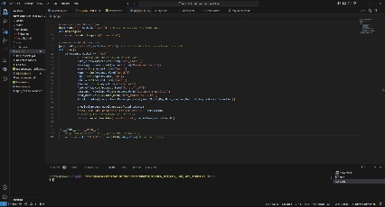

# New_York_City_Taxi_Fare_Prediction

This project aims to predict taxi fares based on various input features using machine learning models. It includes a Jupyter Notebook for model training and a Flask web application for user interaction.

## Summary of the Project

The Taxi Fare Predictor leverages historical taxi fare data to train a machine learning model that predicts the fare based on various input features. The web application allows users to input trip-specific details and receive a predicted fare.

## Steps Involved in the Project

1. **Data Collection and Preprocessing:**
   - Load taxi fare data from `taxifare.csv`.
   - Convert `pickup_datetime` to a datetime object and extract relevant features such as year, month, day, hour, and minutes.
   - Drop unwanted columns and handle any missing values.

2. **Feature Engineering:**
   - Create new features such as `distance_travelled` using haversine distance from `pickup_longitude`, `pickup_latitude`, `dropoff_longitude`, `dropoff_latitude`  and  another feature `part_of_day` AM (0) / PM (1) using `Hour` feature.


3. **Model Training:**
   - Store the preprocessed data in MongoDB
   - Split the data into training and testing sets.
   - Train regression models such as Linear, Ridge, Lasso,  Random Forest, Gradient Boosting, and XGBoost.
   - Evaluate the models using metrics Mean Squared Error (MSE), .

4. **Model Saving:**
   - Save the best performing model to a file (`best_model1.pkl`) using pickle for later use in the web application.

5. **Web Application Development:**
   - Develop a Flask web application to take user input and predict the taxi fare using the trained model.

## Commands to Setup Project on Local Machine

1. **Clone the repository:**
   ```bash
   git clone https://github.com/dyavadi8769/New_York_City_Taxi_Fare_Prediction.git
   cd New_York_City_Taxi_Fare_Prediction

2.  **Create a virtual environment and activate it:**
    ```bash
    conda create -p env python==3.11 -y
    conda activate env/ 

3.  **Install the Required Dependecies:**
    ```bash
    pip install -r requirements.txt

4. **Run the Web App:**
    ```bash
    python app.py

## Usage




## Contributing

1. Contributions are welcome! Please fork the repository and create a pull request with your changes. 
2. Ensure that your code adheres to the project's coding standards.

# Author:

```bash
Author: Sai Kiran Reddy Dyavadi
Role  : Data Scientist
Email : dyavadi324@gmail.com
```
